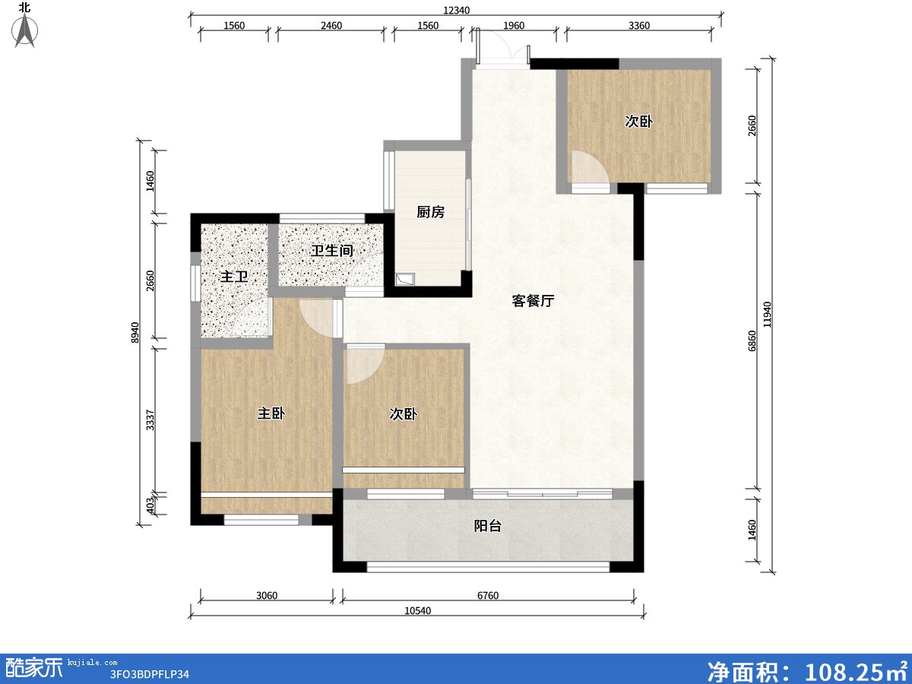
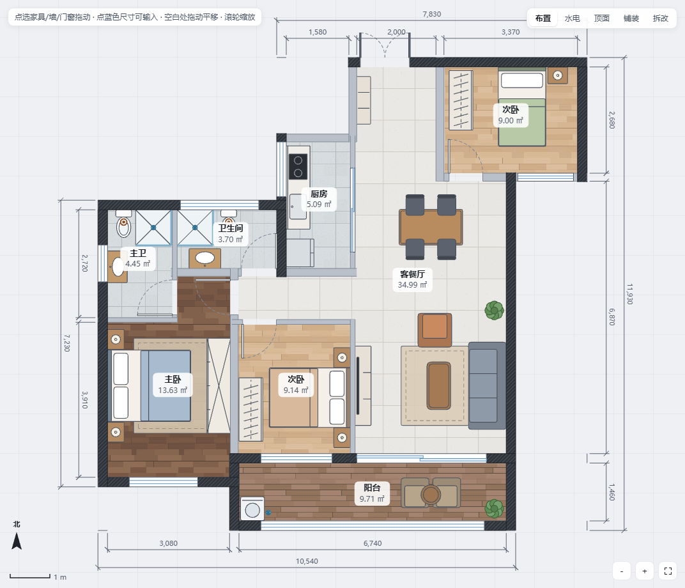
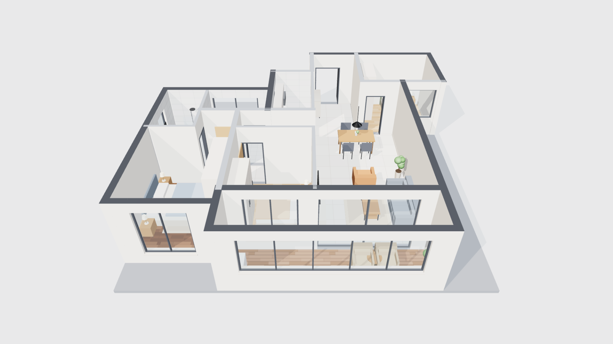
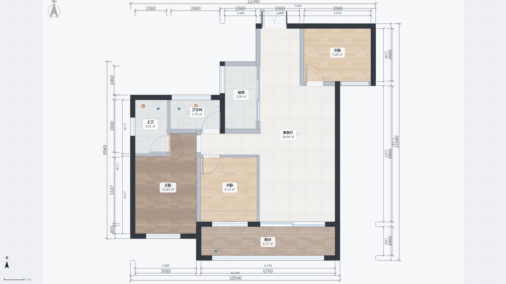

# 户型图设计器 Skill

**一张户型图，一句话，Agent 就把它还原成可 2D/3D 直接设计的装修设计器网页。**

把任意一张户型图交给 Agent，它会自动量墙、看懂图纸、补全门窗和房间、摆好家具，最后交给你一个**双击就能打开的单文件 HTML**。打开就是你的户型，能 2D 布置、3D 漫游，还能出水电、吊顶、铺装、拆改图、算量报价和整套施工图。

适用于任何支持 Skill 的 Agent。

| 输入：一张户型图 | 输出：设计器里的 2D 布置 | 同一份数据的 3D 鸟瞰 |
|:---:|:---:|:---:|
|  |  |  |

## 用法

对你的 Agent 说：

```
把这张户型图做成装修设计器网页
```

再附上户型图即可。Agent 会按 [`SKILL.md`](SKILL.md) 的流程工作，最后在图片旁边生成 `<户型名>-装修设计器.html`，并附上 2D、3D 截图。

## 它是怎么做到的

1. **量墙**：`scripts/analyze.py` 用 OpenCV 提取墙体，再用最外圈的标注尺寸算准比例（毫米/像素），宽、深两个方向互相校验。
2. **看懂图纸**：Agent 对照原图和带像素标尺的识别图，补全算法漏掉的墙（被窗户打断的墙、很细的隔墙），分清门和窗、门往哪边开，认出每个房间，写出户型描述 JSON。
3. **自己检查**：`scripts/build.py` 生成网页，`scripts/check.mjs` 用无头浏览器打开，检查房间是否闭合、有没有悬空的墙、门窗有没有被丢掉，并把生成结果半透明叠回原图截图。不对就改，循环到墙墙重合。
4. **自动布置**：按房间功能摆好家具和家电（床、衣柜、沙发、餐桌、橱柜、卫浴、空调、热水器、浴霸、晾衣架、窗帘……），放上地漏和下水口；户型描述写上 `"autoElec": true`，设计器会按房间、门窗和家具自动布好全套水电并把开关关联到灯，再跑一遍方案检查。



## 生成的设计器能做什么

- 2D 平面、3D 鸟瞰、第一人称漫游；🔒 3D 锁定防误触
- **真实日照**：按城市纬度、月份、时间计算太阳位置，指北可调；蓝天 / 晚霞 / 星空随时间变化，太阳落山后换成月光；一键“日照演示”从日出放到深夜
- **3D 可交互**：点墙上的开关就能开关它关联的灯（双控两处都能控、调光开关调亮暗、三开分路），时间拖到夜里整屋自动亮灯；门能开关（关着的门会挡路），窗帘能拉、电视能开、台灯落地灯能点亮
- **尺寸精确**：墙体转角 / 丁字口按相交墙的厚度精确接合（不再冒出一截）；房间面积按墙面精确计算；外围三道尺寸（门窗分段、墙厚 + 净距、总长）、每段墙净长、房间开间 × 进深都标上，改墙后实时重算；识图脚本能找出图上的尺寸线刻度，配合 `axismap.py` 按标注尺寸精确定位墙
- **承重墙识别**：按墙体填充颜色自动聚类区分承重 / 非承重，颜色分不开时按厚度猜并标出待确认；支持只画边线的隔墙（`--outlined`）
- **自定义铺砖**：砖的长宽、灰缝、8 种铺法（直铺、工字铺、1/3 错缝、斜铺、人字拼、田字编织、双色棋盘、随机错缝）、6 种纹理、砖色缝色、起铺点，一块块铺；2D、3D、报价同步，报价按整砖 + 切砖片数算
- **视觉风格与配色**：写实 / 彩平图（正上方俯视的彩色平面图：材质纹理地面、深色剖切墙、家具柔和投影、房间名面积、尺寸线、指北针，可一键导出 4000 像素高清 PNG）/ 沙盘效果图（实物微缩模型感：清晰日光阴影、环境光遮蔽、移轴景深、底座投影、灯带辉光、地面房间名、圆润家具；绿植是真叶片），方案原色 + 12 套主题配色（奶油白、原木、莫兰迪、侘寂、北欧、中古、新中式、法式、工业风、极简黑白、海风、深色夜景），鸟瞰、漫游、渲染出图都保持
- 家具家电库 130 件：空调、热水器、油烟机、洗碗机、饮水机、浴霸、晾衣架、窗帘；U 形 / 弧形 / L 形沙发、贵妃椅、圆床、圆餐桌、卡座、酒柜、展示柜、L 形橱柜、双盆浴室柜、独立浴缸、壁挂马桶、壁炉、鱼缸、投影幕布、绿植装饰、健身和宠物用品等
- 门窗 12 种：单开门、双开门、子母门、推拉门、折叠门、隐形推拉门、门洞；平开窗、推拉窗、落地窗（带护栏）、高窗、飘窗
- 水电点位 28 种（插座、开关、灯具、弱电、给排水、空调孔、燃气等），**一键布置水电**：主灯和门边开关、床头双控、电视墙和橱柜插座、冷热水、排水、燃气、空调孔、强弱电箱，开关自动关联灯
- 布置 / 水电 / 顶面 / 铺装 / 拆改，五种图层
- 画墙、拆墙、改门窗，面积实时重算
- 墙顶地材质、吊顶、踢脚线、立面图
- 方案检查：家具重叠、挡门、通道太窄、马桶离下水口太远、家电附近缺插座或水点、吊柜挡窗等
- 自动算量报价，导出整套 A3 施工图 PDF
- 多方案管理与对比，自动保存，导出分享文件
- 左侧“户型”面板可显示原图底图，随时对照

## 实测案例

三室两卫，12340 × 11940（就是上面那张图）：

| 项目 | 结果 |
|---|---|
| 比例校验 | 按宽 17.65 / 按深 17.61 毫米每像素 |
| 墙体 | 21 面，其中 8 面由 Agent 补全 |
| 门窗 | 8 门 7 窗，全部就位 |
| 房间 | 8 间，全部识别 |
| 外轮廓误差 | 10 毫米 |

完整的户型描述在 [`reference/example-spec.json`](reference/example-spec.json)，生成它的脚本在 [`reference/example-gen.py`](reference/example-gen.py)。

## 安装

1. 把本仓库放进你的 Agent 的 skills 目录，例如：

   ```bash
   git clone https://github.com/<你的用户名>/house-plan-designer ~/.claude/skills/house-plan-designer
   ```

   其他 Agent 放到各自约定的 skills 目录即可。

2. 安装依赖：

   ```bash
   pip install numpy pillow opencv-python
   cd scripts && npm install
   ```

3. 本机需要有 Chrome 或 Edge，自查截图要用。找不到时，设置环境变量 `CHROME_PATH` 指向浏览器程序。

## 目录

```
SKILL.md                    Agent 读的流程说明
assets/template.html        设计器模板（单文件，three.js 已内联）
scripts/analyze.py          户型图墙体识别 → 比例 + 初稿
scripts/build.py            户型描述 JSON + 原图 → 设计器网页
scripts/check.mjs           无头浏览器自查：报告 + 2D / 叠图 / 3D 截图
reference/spec-format.md    户型描述格式（墙、门窗、房间、家具、水电）
reference/example-*         完整示例
```

## 适用范围与局限

- 最适合**彩色、墙体是实心色块、带尺寸标注**的户型图（酷家乐、贝壳、房天下、售楼处户型图）。
- 纯线稿、扫描件、拍歪的照片，自动识别的初稿会很差。这时主要靠 Agent 根据尺寸标注推算，需要多改几轮。
- 图上没有任何尺寸时，Agent 会问你要一个已知尺寸，或者按常见尺寸估算并注明。
- 存档保存在浏览器本地。换电脑或发给别人时，用设计器里的“导出 → 分享文件”。
